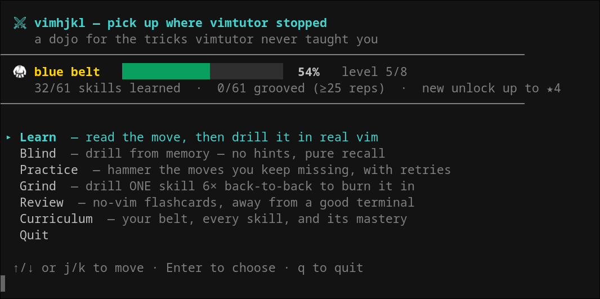
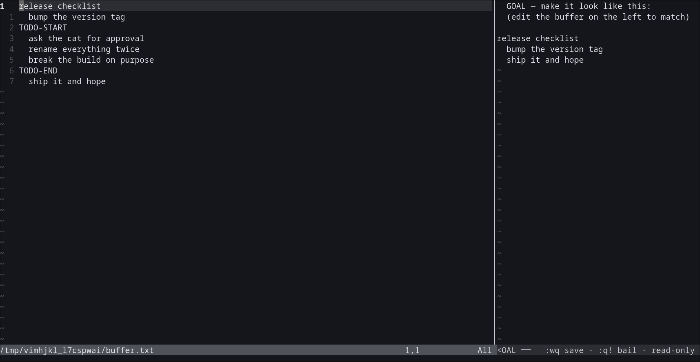
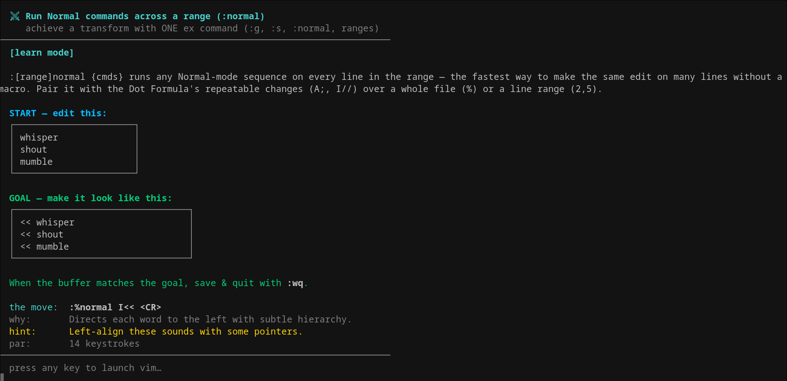
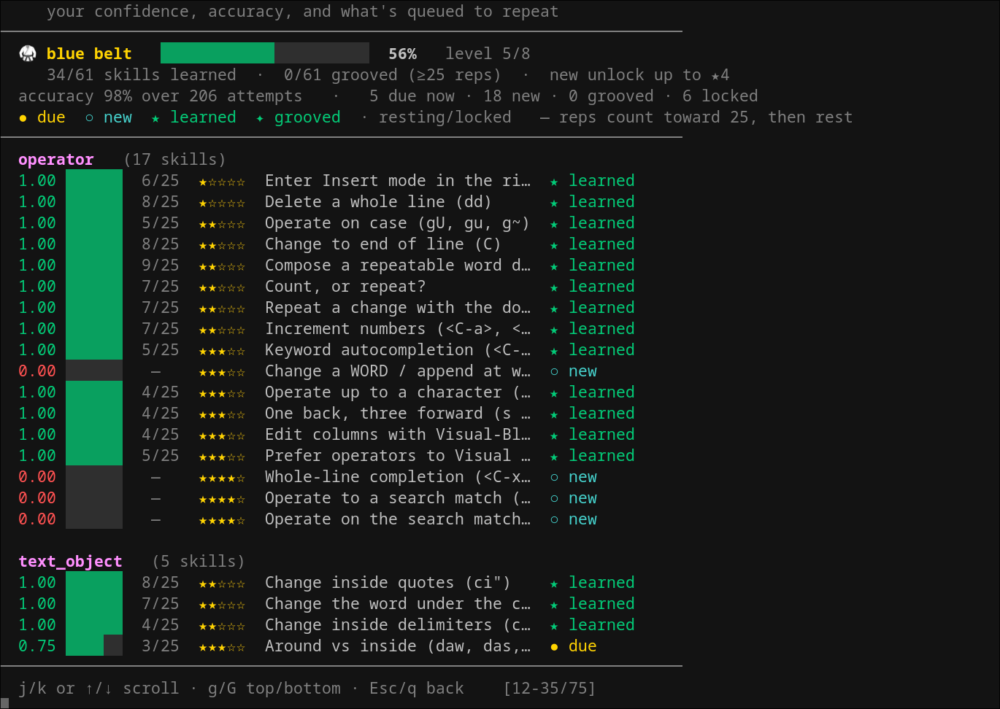

<div align="center">

# ⚔ vimhjkl

**The Vim techniques `vimtutor` never taught you — drilled in real vim/nvim, graded on your actual keystrokes.**

[](https://aur.archlinux.org/packages/vimhjkl)
[](LICENSE)


</div>

⭐ Star it if it makes you faster — it helps a lot!

The dot command, operator + motion grammar, text objects, registers, macros, ex
commands (`:g`, `:normal`, ranges), and substitution — **61 lessons, 548
challenges**, every one replayed through real vim so the "optimal" it shows you
actually works. While you edit, the goal sits in a pane beside the buffer, so you
practise the move instead of remembering it.



## Contents

- [Install](#install)
- [Usage](#usage)
- [How it works](#how-it-works)
  - [Progression](#progression)
- [Contributing](#contributing)
- [License](#license)
- [Star History](#star-history)

## Install

### macOS / Linux ([Homebrew](https://brew.sh))

```sh
brew install S-Sigdel/tap/vimhjkl
```

### Arch Linux ([AUR](https://aur.archlinux.org/packages/vimhjkl))

```sh
paru -S vimhjkl      # or: yay -S vimhjkl
```

### From source

Needs [uv](https://docs.astral.sh/uv/) and `vim` or `nvim` on `PATH` — no other
dependencies.

```sh
git clone https://github.com/S-Sigdel/vimhjkl && cd vimhjkl
uv sync && uv run vimhjkl
```

## Usage

```sh
vimhjkl                                     # interactive menu   (from source: uv run vimhjkl)
vimhjkl --drill                             # Learn: read the move, then drill it
vimhjkl --drill --mode blind                # Blind: before/after only, recall it yourself
vimhjkl --drill --mode blind --blind-all    # endless blind sweep of every skill, no repeats
vimhjkl --practice                          # retry the skills you keep missing
vimhjkl --reps 6 [--skill ID]               # Grind: pick a skill, drill it N× back-to-back
vimhjkl --review                            # no-editor flashcards
vimhjkl --list                              # curriculum, mastery, belt (and skill IDs)
```

Other flags: `-n/--count N` (challenges per session), `--gate D` (only introduce
skills up to difficulty D), `--hide-moves`.

| Mode     | What it does                                            |
|----------|--------------------------------------------------------|
| Learn    | Shows the technique and idiomatic move before you edit |
| Blind    | Before/after only — recall the move; names the expected technique so you aren't blindsided |
| Blind-all| Endless sweep over every skill, free-form (any path), skips ones you've passed |
| Practice | Your weakest skills, retry until you pass              |
| Grind    | Pick a skill, drill it N times back-to-back (`--reps N`, `--skill ID`) |
| Review   | Read-only flashcards, self-rated, no editor            |

**Settings** (in the menu): turn lessons on/off, and remap any key in any mode
(e.g. `jk` or `<C-p>` → `<Esc>`, `;` → `:`) — your key shows in the suggested move
and is graded as the original.

## How it works

You edit in **real vim**, not an emulator, with the goal pinned in a read-only
pane beside the buffer:



Keystrokes are logged with `-W` and scored on correctness *and* efficiency
against a verified par. Command drills (`:s`, `:g`, `:normal`) require an actual
ex command — you can't hand-edit your way to the goal. Mastery is tracked per
skill with Leitner spaced repetition and a belt rank that unlocks harder material
as your boxes fill.

<details>
<summary>More screenshots</summary>

A lesson in Learn mode:



The curriculum and your mastery:



</details>

### Progression

There is **one** mastery model, shared by every mode. Learn, Blind, Practice,
Grind, and even the no-editor Review flashcards all write to the same boxes — the
mode only changes how much help you see *before* you edit, never whether the
result counts. You don't "level up from Blind only"; a clean solve in Learn counts
exactly the same.

What moves the needle is committing a **passing** attempt: correct *and* efficient
(no more than 2× the verified par in keystrokes). Quitting a buffer drill without
saving is an *abstain* — it leaves your mastery untouched, so stopping early never
costs you.

Mastery has two axes:

- **Leitner box (1 → 5)** — *do you know the move?* A fast, clean solve bumps the box
  up; a slow-but-correct one holds it; a wrong answer knocks it down — and one slip at
  the top box is forgiven. The box drives how soon a skill comes back, your belt rank,
  and which new skills unlock.
- **Reps toward grooved (25)** — *have you drilled it into muscle memory?* A
  box-maxed skill keeps resurfacing on the normal schedule until it has 25 clean
  reps; only then is it `✦ grooved` and moves to a rare maintenance schedule. A
  later miss drops the box and pulls it back into active review.

New material is gated by difficulty: harder skills unlock only once the tier below
them is mastered, so the curriculum opens up as your boxes fill rather than
dumping everything at once.

| Mode     | Recording                                                       |
|----------|----------------------------------------------------------------|
| Learn    | One outcome per attempt                                        |
| Blind    | One outcome per attempt                                        |
| Practice | One outcome per skill (best of your retries — no thrash)       |
| Grind    | Every rep counts (depth toward the 25)                         |
| Review   | Self-rated: `j` promote · `f` demote · `k` skip                |

## Contributing

Adding a technique is a data change, not an engine change. See
[CONTRIBUTING.md](CONTRIBUTING.md) for the setup, the challenge schema, and how to
run the tests.

## License

[MIT](LICENSE)

## Star History

<a href="https://www.star-history.com/?repos=S-Sigdel%2Fvimhjkl&type=date&legend=top-left">
 <picture>
   <source media="(prefers-color-scheme: dark)" srcset="https://api.star-history.com/chart?repos=S-Sigdel/vimhjkl&type=date&theme=dark&legend=top-left" />
   <source media="(prefers-color-scheme: light)" srcset="https://api.star-history.com/chart?repos=S-Sigdel/vimhjkl&type=date&legend=top-left" />
   
 </picture>
</a>
